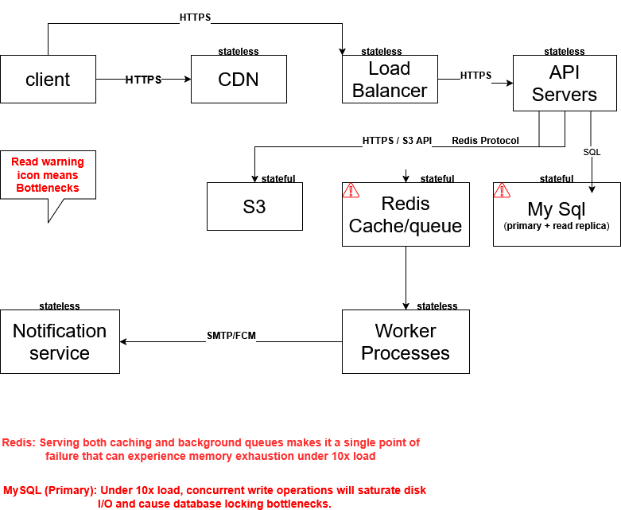

## System Architecture

## Code Coverage

I have implemented automated tests to ensure the stability of the application's business logic.

Command used to run tests: `php artisan test --coverage --min=80`
Total Coverage Achieved: 80.5%

## Deliberate Uncovered Path Note

Factories\ArticleFactory (39.1%):
    Model factories are testing utility tools used strictly to generate dummy data for Feature tests. They do not contain production business logic.

Policies\ArticlePolicy (Static Methods):
    Methods like viewAny or static authorization methods that currently return a hardcoded true by default were left without dedicated variations. They don't contain dynamic execution logic dependent on user state yet. They will be fully targeted once we add thier ridght functionality.